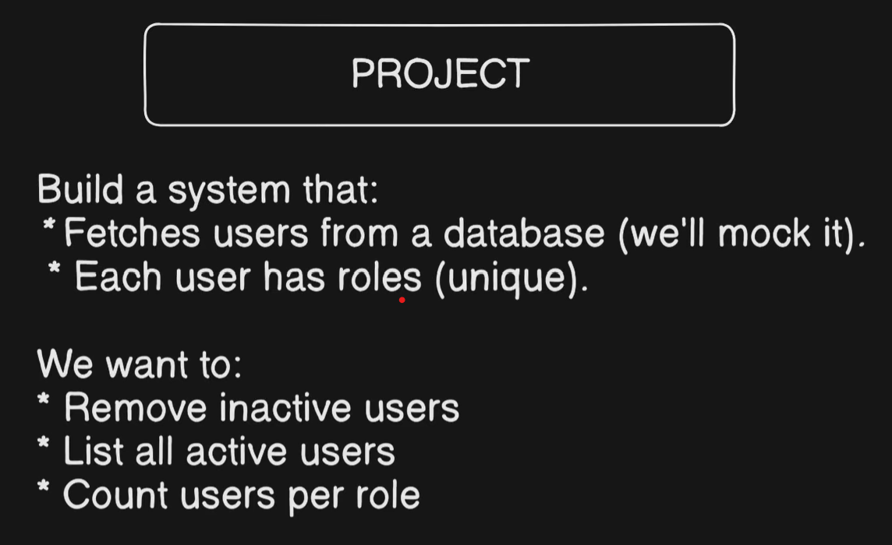

# User Management System (Java)

## 📌 Description
This is a simple Java application that demonstrates:
- Object-Oriented Programming (OOP)
- Collections (List, Set, Map)
- Iterator usage
- Filtering active users
- Counting roles using HashMap

## 🚀 Features
- Stores users with roles
- Removes inactive users safely using Iterator
- Displays active users
- Counts number of users per role

## 🛠️ Technologies Used
- Java
- Collections Framework

## ▶️ How to Run
1. Clone the repository
2. Compile the files:

## 📸 Problem Statement

